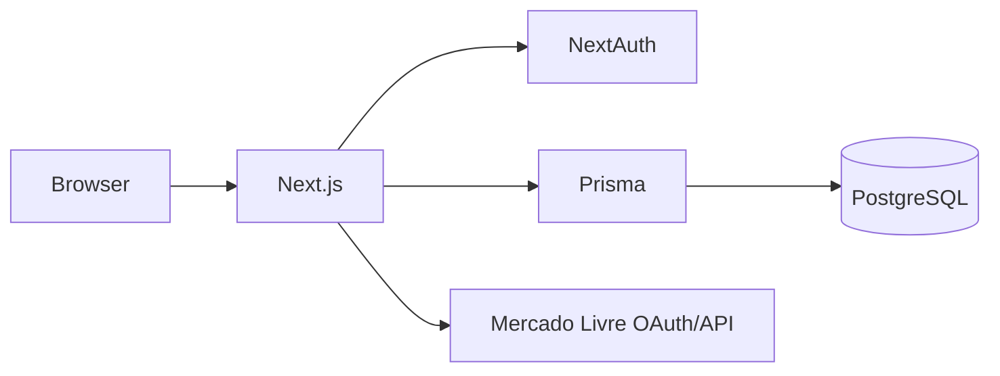

# Portfolio overview

## Architecture

## Core flow

1. An administrator authorizes a seller connection through signed, expiring OAuth state.
2. The integration refreshes credentials only when necessary.
3. Product and order notifications are deduplicated before synchronization.

## Visual walkthrough

The public safe demo is hosted at https://jhonwictordev.github.io/martins-tech-place/. It contains an illustrative catalogue only, with no OAuth, credentials or production orders.

## Environment and data

Copy .env.example, set PostgreSQL and NextAuth values, then run Prisma generation and migrations. Seeded records are demonstrative; a real seller account is never required to inspect the UI.

## Decisions

- OAuth state is signed and short-lived to prevent account-linking attacks.
- Webhook idempotency lives in the database, rather than a best-effort cache.
- Marketplace integration is intentionally disconnected in public demonstrations.
